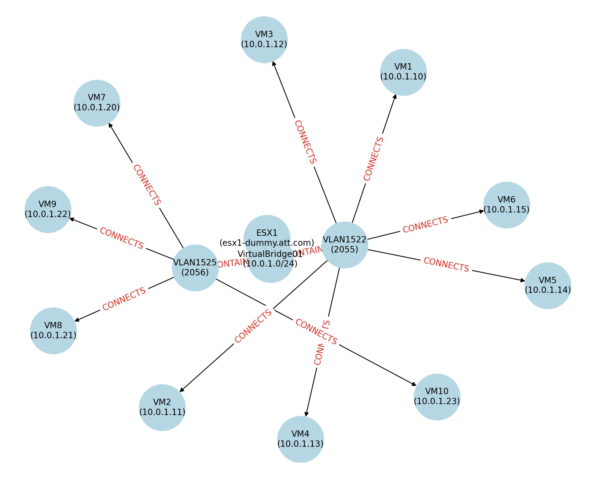

Sample code to take in VMWare XML input and auto-generate OCPV migration artefacts (eg NMState, NAD, NNCP YAMLs)
<h6>file.xml :</h6> input vmware deployment as xml
<h6>main.py :</h6>
- parse VMWare XML input to populate graph data structure, visualized like so :

- walks the graph recursively, applying specific treatments for migration
- only one treatment is currently implemented : look for vSWitches and attached PortGroups = VLANs, generate NAD YAMLs per VLAN, generate 1 global NNCP YAML, 1 global NMState YAML.
- assumes hardcoded 'eth0' and 'eth1' physical interfaces on the ESX node to be bonded (should be generalized to read from ESX node in XML input) 
<h6>nad.py, nncp.py, nmstate.py</h6> 
<h6>TODO: generate XML from VMWare discovery input</h6>
